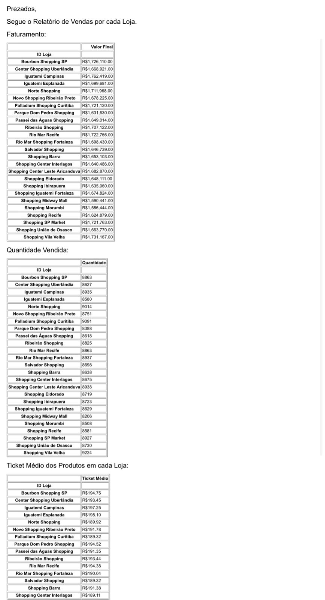

# 🚀 Automação de Relatório de Vendas com Python

<p align="center">
  
  
  
  
</p>

---

## 📌 Sobre o Projeto

Este projeto foi desenvolvido em Python com o objetivo de automatizar a análise de vendas de diferentes lojas e enviar relatórios automaticamente por e-mail utilizando o Outlook.

A automação realiza:

✅ Leitura de planilhas Excel  
✅ Cálculo de faturamento por loja  
✅ Quantidade de produtos vendidos  
✅ Ticket médio por loja  
✅ Envio automático de relatório por e-mail  

---

# 🛠️ Tecnologias Utilizadas

- Python
- Pandas
- Openpyxl
- PyWin32
- Excel
- Outlook

---

# 📊 Funcionalidades

## 🔹 Importação da Base de Dados
O sistema lê automaticamente a planilha Excel contendo os dados de vendas.

## 🔹 Faturamento por Loja
Calcula o valor total faturado por cada loja.

## 🔹 Quantidade de Produtos Vendidos
Mostra a quantidade total de produtos vendidos por loja.

## 🔹 Ticket Médio
Calcula o ticket médio dos produtos vendidos.

## 🔹 Envio Automático de E-mail
Gera e envia automaticamente um relatório formatado via Outlook.

---

# 📸 Demonstração

## 📧 E-mail recebido automaticamente



---

# 💻 Trecho do Código

```python
faturamento = tabela_vendas[['ID Loja', 'Valor Final']].groupby('ID Loja').sum()

ticket_medio = (faturamento['Valor Final'] / quantidade['Quantidade']).to_frame()
```

---

# ▶️ Como Executar o Projeto

```bash
pip install pandas
pip install openpyxl
pip install pywin32
```

Depois execute:

```bash
python MeuArquivo.py
```

---

# 📁 Estrutura do Projeto

```bash
📦 automacao-relatorio-vendas
 ┣ 📄 MeuArquivo.py
 ┣ 📄 Vendasp.xlsx
 ┣ 📄 README.md
 ┗ 📷 email-relatorio.jpeg
```

---

# ✨ Objetivo do Projeto

Este projeto foi criado com foco em automação de processos e análise de dados utilizando Python, simulando uma rotina real de negócios para otimizar tempo e produtividade.

---

# 👩‍💻 Desenvolvido por

**Stephany Rodrigues**
